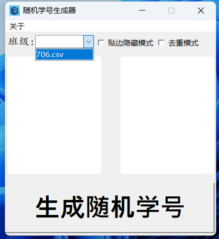

# 随机学号生成器
- [英文版本 English Version](README.md) 

此生成器用于给老师进行随机抽号， 使用Python Tkinter编写, 使用了第三方库PyAutoGUI用以获取鼠标位置，开源免费， 已打包为EXE文件。详细代码见[github](https://github.com/nanocode38/Random-Number-Generator)

## 使用方法
1. 双击程序文件`RandomStudentNumberGenerator.exe`, 启动程序。如果您下载的是Github源代码, 可以在`dist`目录中找到程序文件, 此时您需要将程序文件移动到源代码根目录下, 因为只有这样程序才能找到`data`目录加载需要的数据。启动后节目应该如下:

2. 将您的学生按照学号排号之后使用`逗号分隔值`格式编写, 示例:
```csv
学生1, 学生2, 学生3, 学生4 ...
```
然后保存为`csv`文件, 名称为`班级名.csv`, 并将这个文件放在程序所在目录里的`data`目录内。接下来将`班级`一栏填写为需要的班级。如图:

3. 点击`生成随机学号`按钮, 随机抽取一个学号。勾选`去重模式`复选框, 可以保证随机抽取一个不重复的学号。
4. 勾选`贴边隐藏模式`复选框, 此时软件将置顶。当您吧软件靠近屏幕边缘时, 软件会自动化为小按钮, 只有当点击或鼠标悬停在小按钮上时, 软件才会恢复。


5. 以上就是全部功能啦!
