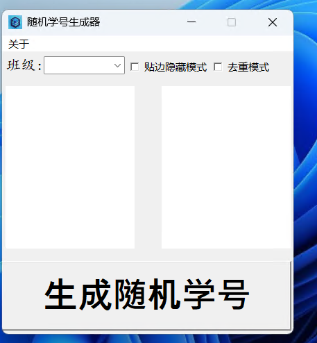

# Random Student Number Generator
- [中文版本 Chinese Version](README-chinese.md) 

This generator is used for randomly drawing numbers for teachers. It is written in Python Tkinter and uses the third-party library PyAutoGUI to obtain the mouse position. It is open source and free, and has been packaged as an EXE file. For detailed code, please visit [github](https://github.com/nanocode38/Random-Number-Generator). 

## Usage Method
1. Double-click the program file `RandomStudentNumberGenerator.exe` to start the program. If you downloaded the source code from Github, you can find the program file in the `dist` directory. At this point, you need to move the program file to the root directory of the source code, because only in this way can the program find the `data` directory to load the required data. After starting, the program should look like this:


2. After numbering your students by their student IDs, write them in the `comma-separated values` format. Example: ```csv
Student 1, Student 2, Student 3, Student 4... ```
Then save it as a `csv` file, named `class name.csv`, and place this file in the `data` directory within the program's directory. Next, fill in the `Class` column with the required class. As shown in the figure: 


3. Click the "Generate Random Student ID" button to randomly select a student ID. Check the "De-duplication Mode" checkbox to ensure that a non-repeating student ID is randomly selected.

4. Check the "Edge Hide Mode" checkbox. At this time, the software will be pinned to the top. When you move the software close to the edge of the screen, it will automatically minimize to a small button. The software will only restore when you click or hover the mouse over the small button. 
 

5. That's all the functions!

